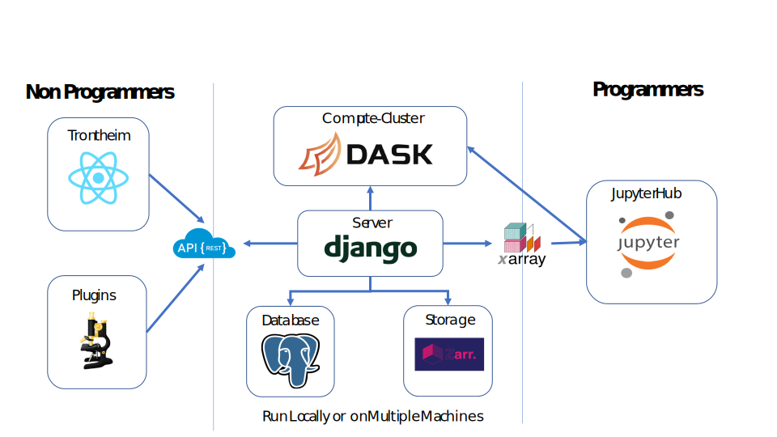

#### Consider this a preview, as the ineptly norwegian codenames might suggest

### Idea

This is a basic helm-chart implementation of the Arnheim Framework, that seeks to implement a working pipeline for the processing
and analysis of microscopic data. Arnheim uses Docker-Containers to ensure most of its workflow is as modular and scalable as
possible. Its architrecture consists of

 * Bergen (the Backend, a django-driven API-Backend)
 * Arbeider ( a worker module that connects to the channel layer and ORM (can isolate heavyweight dependencies like tensorflow and Java)
 * Database ( postgres database for object persistence)
 * Jupyterhub (the Jupyter-Server for easy Access to the Models Provided and the Dask Runtime)
 * Dask (Scheduler and Worker for cluster analysis)

Arnheim uses OAuth system to provide authoriazion and authentification; users are only able to
use the application once registered on the backend, and can login from a variety of different clients (checkout foreign for a 
working implementation using PyQT)

Real-Time Communication is based on an implementation of Django-Channels that is only available for signed-in users.

### Design

### Prerequisites

As Arnheim is based on Kubernetes, you need a working Helm and Kubernetes install